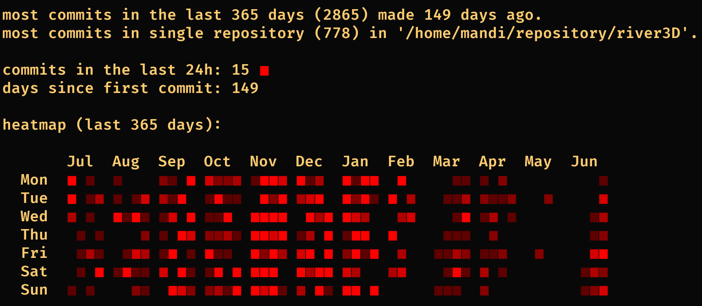
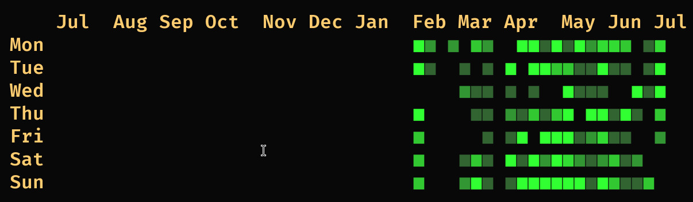
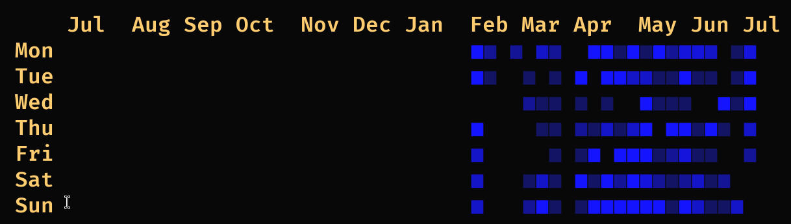
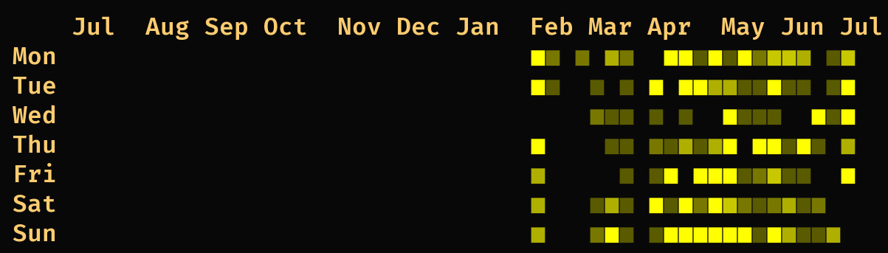
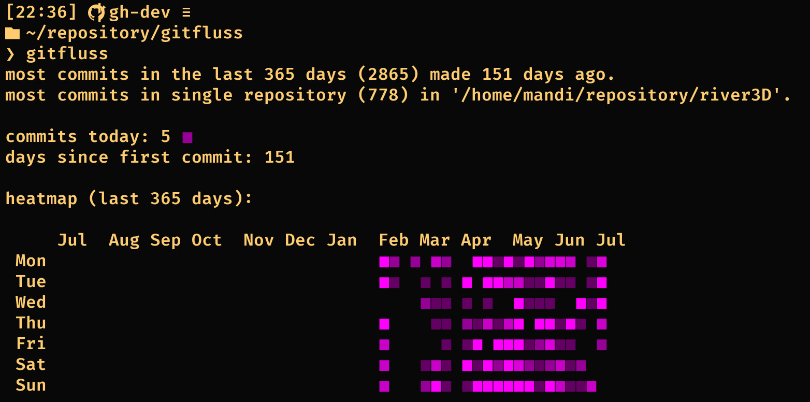

Status:
+ Linux only for now, win32 needs a small bit of porting
+ You can configure a list of paths in the configuration file. `~` and `$HOME` will be
resolved, all other paths must be absolute for now.
+ You can also configure a list of authors to consider (by email)
+ You can choose a colour (red is default):

The configuration file location is `~/.config/gitfluss/.conf`. Gitfluss will look first
in the current working directory for a `.conf` file and then in the config directory.

Example configuration:
```
author: terribleacronym@gmail.com
author: another_author@workplace.org
colour: red
info: false
$HOME/repository/puddle
$HOME/repository/imgsurf
$HOME/repository/river2D
$HOME/repository/river2D_mapedit
$HOME/repository/river3D
$HOME/repository/gitfluss
$HOME/repository/bash-collection
```



other avaiable colours are `green`, `blue`, `yellow`, and `purple`.





with `info: true`, you can see some additional commit history information.


