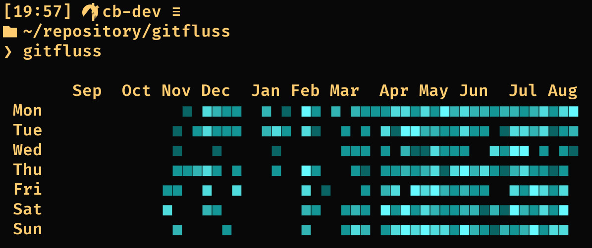
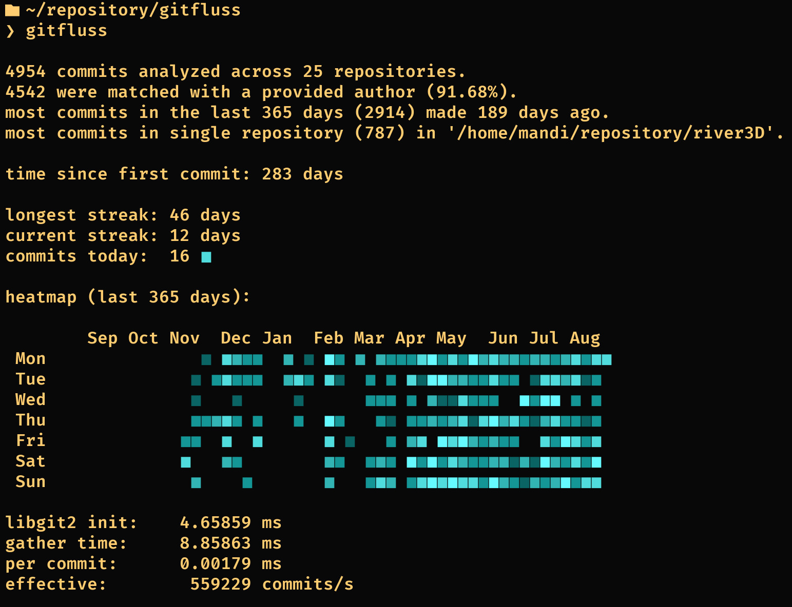
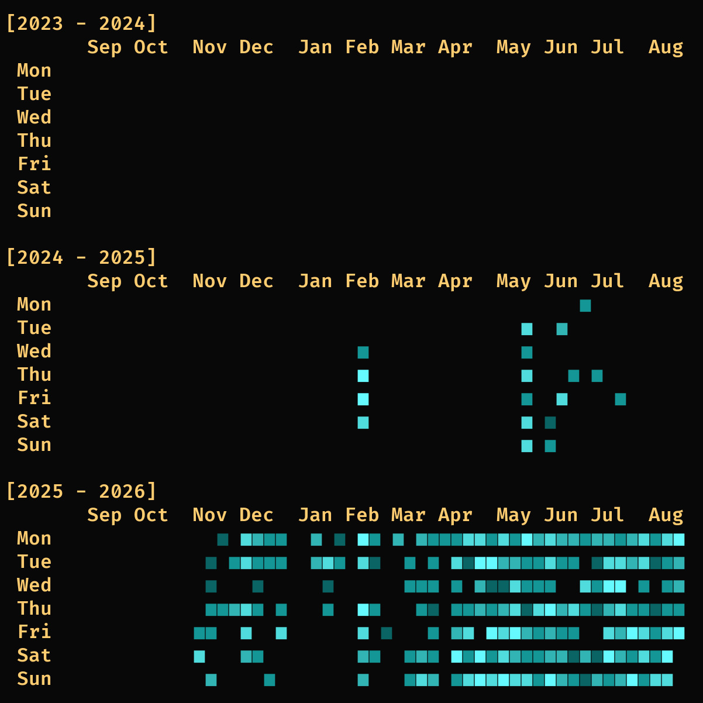
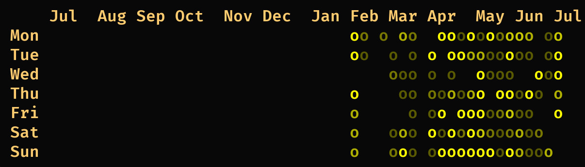
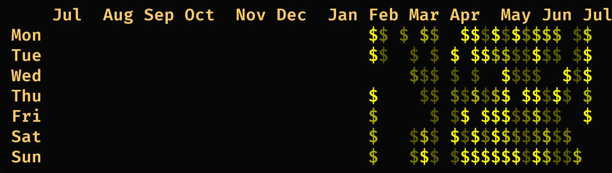
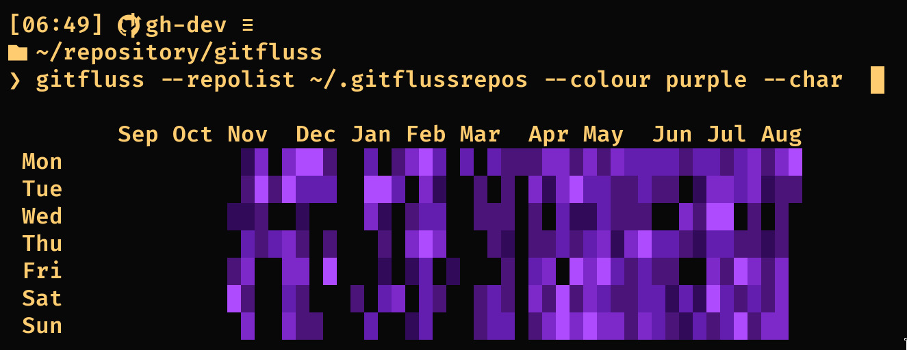
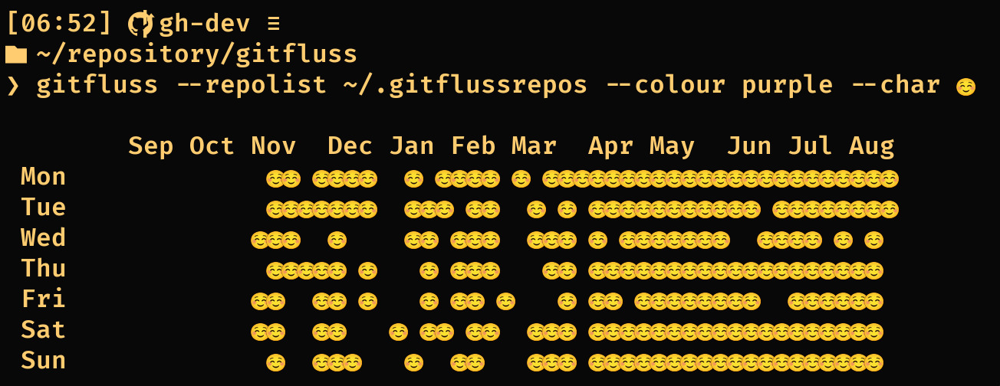
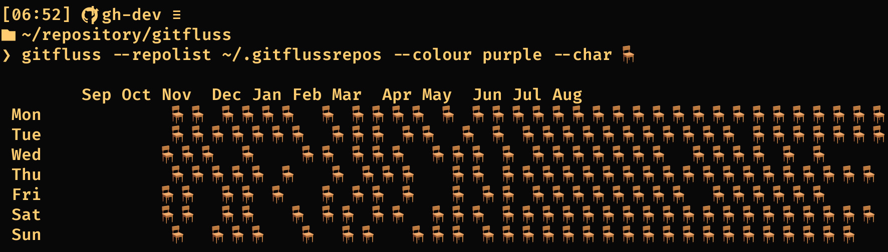
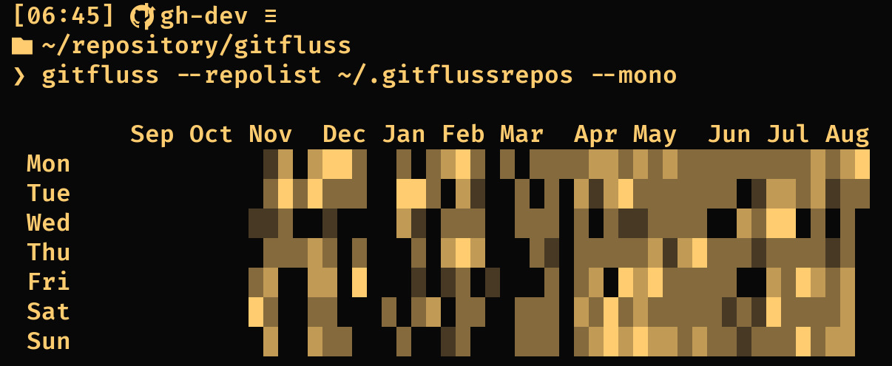
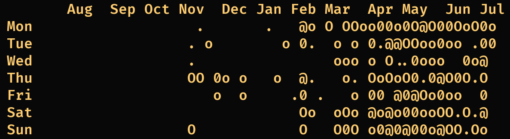

Gitfluss is a neat little cmd git stats view that will pull data from local
repositories, so you can view a unified heatmap across all your projects, whether local
only or cloned from any remote server.

Status:
+ You can configure a list of paths in the configuration file or by passing command-line
  arguments. `~`, `.` and `$HOME` will be resolved, all other paths must be absolute for
  now.
+ You can configure the application to your liking, with author filtering, custom
  colours & characters and more.

Plans:
+ Allow overwriting percentiles
+ Separate streak info into `--streak` option, instead of bundling it with `--info`
+ Expand `--summary`
+ Add more (optional) repository-specific data displays
+ Allow custom RGB colour values
+ Allow flipping axis of heatmaps

Known issues:
+ On Windows, passing non-ascii chars via the cmdline is currently broken, please use
  the configuration file for that.

Example run with all options enabled:



The configuration file location is `~/.config/gitfluss/.conf`. Gitfluss will look first
in the current working directory for a `.gitflussconf` file and then in the config
directory for a `.conf` file.
On windows, `~` or `$HOME` equates to `$env:USERPROFILE` and the paths are
`~/.config/gitfluss/gitfluss.ini` or locally, `gitfluss.ini`.

If, instead, command-line arguments are provided, preferences from the configuration
file will be overwritten.

```
gitfluss . --author name@company.com --colour purple --char ◼ --info
```

Every command-line argument that's not an identifier (such as `--colour`, `--info` or
`--author`) will be read as a path. This is the same way the configuration file works.
Identifiers that need an argument are ignored when none is provided (such as
`--author`).

`--profile` will show miscellaneous timings and stats.

Example configuration file:
```
author: author@provider.com
author: another_author@workplace.org
colour: purple
character: ◼
info: false
profile: false
years: 1
mono: false
$HOME/repository/puddle
$HOME/repository/imgsurf
$HOME/repository/river2D
$HOME/repository/river3D
$HOME/repository/gitfluss
```

Alternatively, lists of authors and files are supported as follows:
configuration file:
```
authorlist: ~/mydir/authorlist_file
repolist: ~/mydir/repolist_file
colour: purple
...
```

`~/mydir/authorlist_file`:
```
author@provider.com
another_author@workplace.org
...
```

`~/mydir/repolist_file`:
```
$HOME/repository/puddle
$HOME/repository/imgsurf
...
```

comments are supported in all files, preceded with `//` (C-style).

The correspoding heat intensities are calculated based on the `20th`, `50th`, `70th` and
`90th` percentile of your commit count per day, not including days with 0 commits.

The avaiable colours are `red`(default), `green`, `blue`, `cyan`, `yellow` and `purple`.

With `info: false`, you can hide the additional commit history information.

With `author: any`, (or not specifying an author at all) you can omit the author check
and count all commits by all authors in the listed repositories.

With `years: 2` (any integer), you can set the amount of years to go back:



And a value of `years: 0` will only display a single year with no interval label.

With `character: ?`, you can actually change the character that's being used to print:

`character: o`


`character: $`


`character: █`


If the character is an emoji, the ANSI terminal colours will not be able to take effect.
`character: ☺️`


Keep in mind that if the character is not monospace, the header will appear to be wrong.
`character: 🪑`


Monochrome support is also built-in, which avoids outputting ANSI colour escape codes to
the terminal. `--mono` in the command-line or `mono: true` in the configuration file
will make gitfluss output in monochrome mode. By default, it will use the full-block
shading characters:



But the `--heat0 .`, `--heat1 o` ... / `heat0: .`, `heat1: o` overrides also work to
replace the characters below each percentile:
```
heat0: .
heat1: o
heat2: O
heat3: 0
heat4: @
```



I am not very skilled at ASCII art as you can see, but those who are may happily use
this feature.
